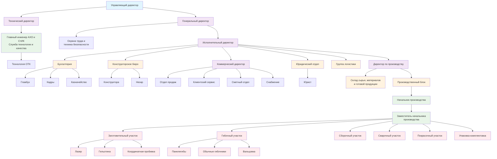

# Организационная структура ООО «Эверест-Тех»

## Ключевые изменения структуры:

**Верхний уровень:**
- Управляющий директор → координирует всю деятельность
- Разделение на технический и операционный блоки

**Технический блок:**
- Технический директор → стратегия развития
- АХО и СтИК → контроль качества

**Операционный блок:**
- Исполнительный директор → операционное управление
- Четкое разделение функций: финансы, продажи, производство

**Производственная цепочка:**
1. Заготовительный (лазер, гильотина, пробивка)
2. Гибочный (панелегибы, вальцовка)
3. Сборочный → Сварочный → Покраска → Упаковка

Схема готова! Нужны корректировки? 🎯